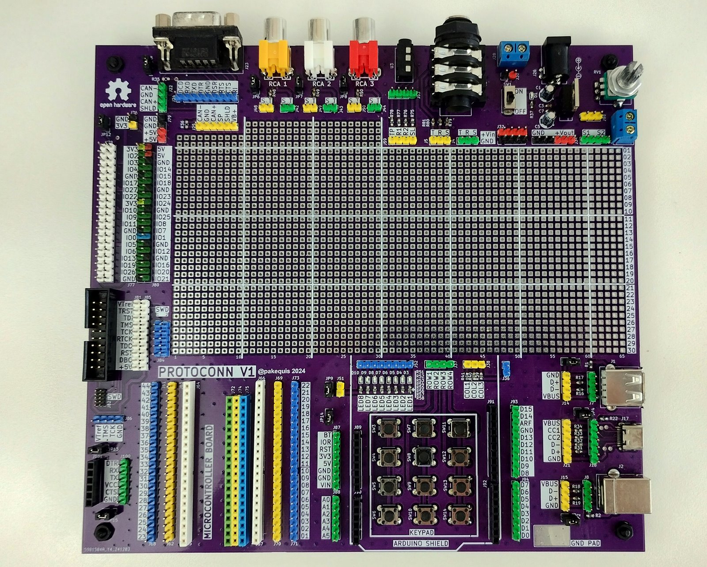
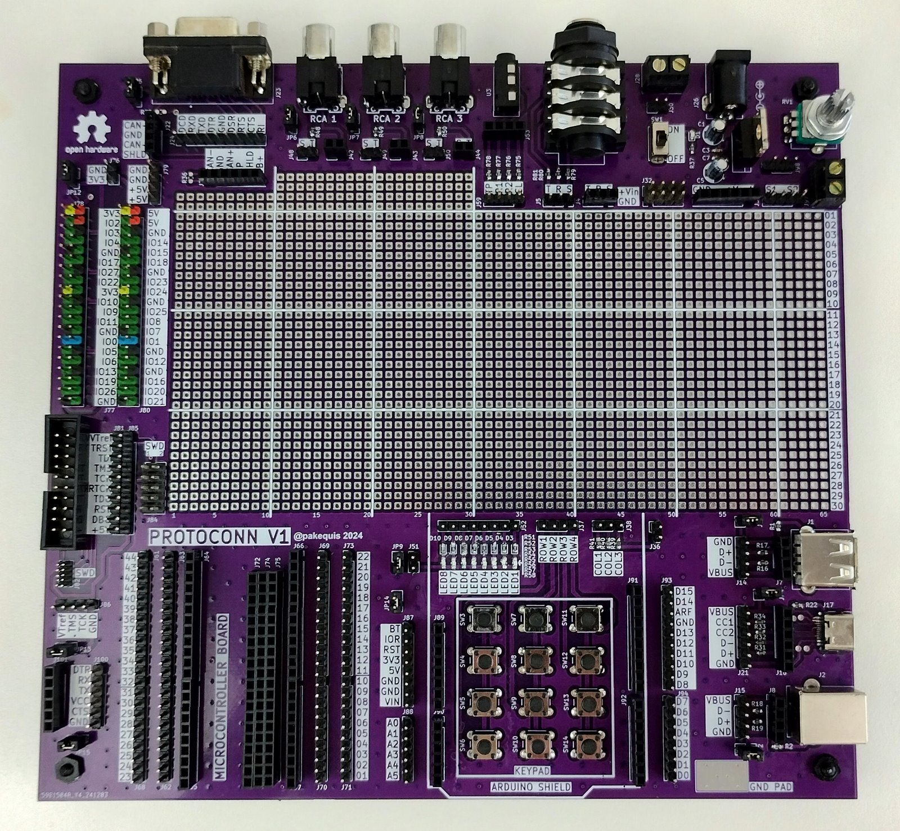
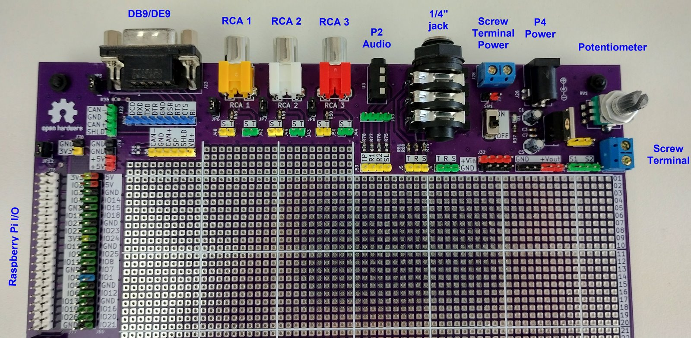
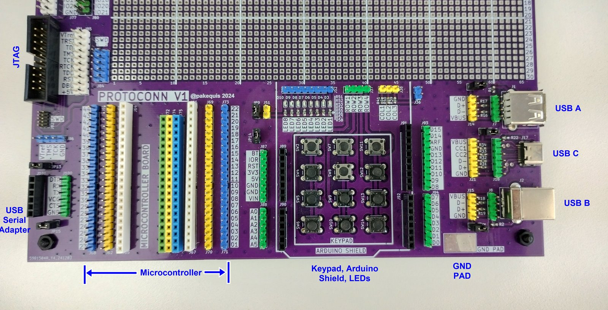
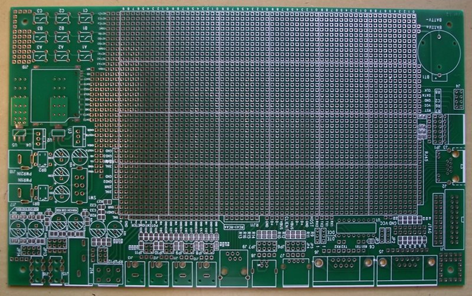

[![CC BY-SA 4.0][cc-by-sa-shield]][cc-by-sa]
# ProtoConn
A prototype board with connectors for electronic testing and development

This work is licensed under a
[Creative Commons Attribution-ShareAlike 4.0 International License][cc-by-sa].

[![CC BY-SA 4.0][cc-by-sa-image]][cc-by-sa]

[cc-by-sa]: http://creativecommons.org/licenses/by-sa/4.0/
[cc-by-sa-image]: https://licensebuttons.net/l/by-sa/4.0/88x31.png
[cc-by-sa-shield]: https://img.shields.io/badge/License-CC%20BY--SA%204.0-lightgrey.svg

### Overview

This open-hardware prototype board was created as a practical tool to simplify and speed up prototyping. With connectors for various functions, it’s designed to make development more flexible and efficient.

## Demo video:

### Features

Size: 200 x 195 mm dual layer PCB.
- **DE-9 Connector**: Supports serial, joystick, or CAN communication.
- **RCA Connectors**: Includes 3 RCA connectors.
- **Audio Connectors**:
  - 1 P2 audio jack (up to 4 pins).
  - 1 6.3 mm audio jack.
- **Screw Terminals**: Includes 2 screw terminals, one dedicated to power supply.
- **Barrel Connector**: For power input, with integrated 78XX voltage regulator and on/off switch.
- **Potentiometer or Rotary Encoder**: For adjustable input functionality.
- **40-Pin I/O Connector**: Compatible with Raspberry Pi and other Single Board Computers (SBCs).
- **JTAG Connector**: Standard 20-pin JTAG interface.
- **SWD Connectors**:
  - 10-pin SWD with 2.54 mm pitch.
  - 10-pin SWD with 1.27 mm pitch.
- **Programming Connector**: 4-pin interface for STM32 programming.
- **USB/Serial Converter Connector**: Simplifies communication setup.
- **Microcontroller Spaces**: Dedicated spaces for microcontroller boards with widths of 600, 700, 800, and 1000 mils.
- **Arduino Shield Compatibility**: Area for connecting Arduino-compatible shields.
- **Matrix Keypad**: Includes a 12-key matrix keypad.
- **LED Indicators**: 8 LEDs with current-limiting resistors.
- **USB Connectors**:
  - 1 USB Type-A connector.
  - 1 USB Type-B connector.
  - 1 USB Type-C connector.
- **Ground Pad**: Convenient GND pad for prototyping needs.

### Project Files
All project files are organized in the `hardware` folder. If you'd like to manufacture an identical board, the Gerber files necessary for production are available in the `hardware/fab` folder.

Please note that the board does not need to be assembled exactly as shown in the photo. You are free to assemble only the components you want or need, tailoring it to your specific requirements.

Because of this flexibility, the project does not include a complete bill of materials (BOM). Please refer to the notes in the schematic diagram for more detailed information.

Below is an example of an assembled board featuring common black connectors:

## Recommended Components

Here are some specific components that can be used with this board, along with links to purchase them:

- **Colorful Breakable Pin Header 2.54mm Single Row Male**: [Aliexpress](https://s.click.aliexpress.com/e/_op1UJvb)
- **Colorful Breakable Pin Header 2.54mm Single Row Female**: [Aliexpress](https://s.click.aliexpress.com/e/_oB8GhPJ)
- **40-Pin Header for Raspberry Pi**: [Aliexpress](https://s.click.aliexpress.com/e/_oCoQNaN)
- **USB Type-C 02 Connector**: [Aliexpress](https://s.click.aliexpress.com/e/_oo63JmH)
- **Power switch**: [Aliexpress](https://s.click.aliexpress.com/e/_oD5kKvX)

The other components are common and easy to find.

**Affiliate Disclosure**: Some of the links provided in this section are affiliate links. This means that I may earn a commission if you make a purchase through these links, at no additional cost to you. Your support helps to maintain and improve this project.

### Connector Areas

Below are images showcasing the connector areas of the board:

### Top Connector Area

### Bottom Connector Area

### Project Background:
Almost 20 years ago, I purchased a commercial prototype board with multiple connectors that greatly facilitated my work. Unfortunately, I no longer remember where I bought it, and I am unsure if it is still being manufactured. This inspired me to create my own version, customized to meet my specific needs.

The board (circa 2008):

## Contact:

Feel free to reach out to me on social media: @pakequis in any of them...

You can also send me an email at pakequis (Gmail).

